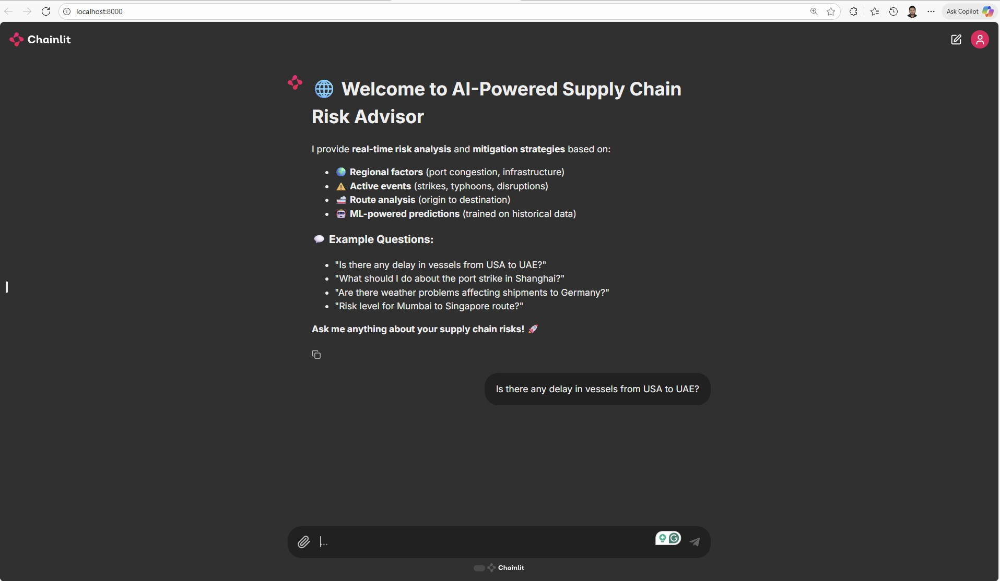
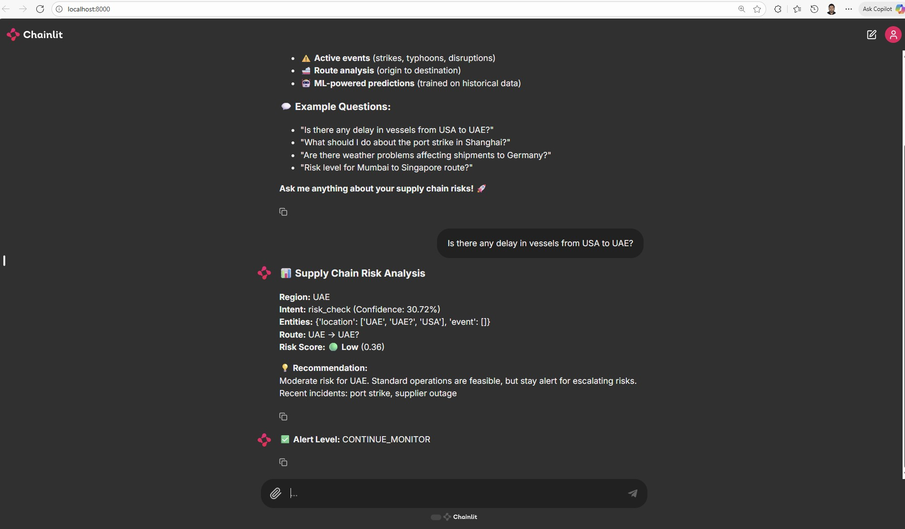

Photo by <a href="https://unsplash.com/@coopery?utm_source=unsplash&utm_medium=referral&utm_content=creditCopyText">Mohamed Nohassi</a> on <a href="https://unsplash.com/photos/a-white-robot-with-blue-eyes-and-a-laptop--0xMiYQmk8g?utm_source=unsplash&utm_medium=referral&utm_content=creditCopyText">Unsplash</a>


[](https://github.com/ellerbrock/open-source-badges/)

Badge [source](https://shields.io/)

# AI-Powered Supply Chain Risk Advisor Chatbot

An end-to-end open-source conversational assistant for real-time supply chain risk analysis and management, built on TensorFlow.

Hugging Face Spaces Chainlit App link : [https://huggingface.co/spaces/samithcs/chainlit-supplychain-app](https://huggingface.co/spaces/samithcs/chainlit-supplychain-app)

Docker link : [https://hub.docker.com/repository/docker/samithc/chainlit-supplychain-app](https://hub.docker.com/repository/docker/samithc/chainlit-supplychain-app)

## Authors

- [Samith Chimminiyan](https://www.github.com/samithcsachi)

## Table of Contents

- [Authors](#Authors)
- [Table of Contents](#table-of-contents)
- [Problem Statement](#problem-statement)
- [Tech Stack](#tech-stack)
- [Quick glance at the results](#Quick-glance-at-the-results)
- [Lessons learned and recommendation](#lessons-learned-and-recommendation)
- [Limitation and what can be improved](#limitation-and-what-can-be-improved)
- [Work Flows](#workflows)
- [Run Locally](#run-locally)
- [Contribution](#contribution)
- [License](#license)

## Problem Statement

Global supply chains are increasingly vulnerable to disruptions caused by weather, geopolitical instability, logistics delays, and unforeseen incidents. Small and mid-sized enterprises lack real-time visibility and actionable insights for proactive risk management. Existing solutions are either expensive, limited to large-scale enterprises, or depend on manual monitoring. This project asks:

How can we empower every business and logistics manager, regardless of scale, with a free and intelligent AI chatbot to analyze supply chain risks, forecast disruptions, and deliver actionable insights in real time?

## Tech Stack

- Python
- TensorFlow
- Chainlit
- DistilBERT
- Hugging Face Transformers
- FAISS
- Docker
- GitHub Actions
- Hugging Face Spaces
- FastAPI

## Quick glance at the results

Chainlit App





## Lessons learned and recommendation

### Lessons Learned:

- Modular Design: Each ML component (NLP, NER, risk scoring, time series) is independent, making debugging and updates easy

- Data Pipeline Robustness: Pre-check and validate every incoming data source, including news and API formats

- Scalable API Integration: Test all external API calls for edge cases and timeouts

- Cloud Deployment: Lean Docker images and requirements files speed up CI/CD and minimize hosting pain points

### Recommendations:

- Keep documentation clear for onboarding contributors

- Actively monitor logs when hosting to catch pipeline failures

- Consider adding support for new regions and risk types in next versions

## Limitation and what can be improved

### Current Limitations:

- Model Constraints: Small models may not handle highly ambiguous risk scenarios—consider options for larger LLMs

- File/Data Formats: Only standard data formats are reliably processed; expand coverage for unusual formats

- User Features:

  - Current: Chatbot is public and anonymous; does not keep chat history or user sessions.

  - Planned: Future updates will add authentication, query history, admin controls, and monitoring.

  - Limitation: Users cannot review previous chats—session history is not stored.

- APIs & Data Sources:
  Relies on free and publicly available APIs (e.g., open weather, news data) for external event ingestion. These may have usage limits, lower reliability, less frequent updates, or restricted data compared to commercial/paid APIs.

- Cost and Resource Constraints:
  No paid APIs or cloud hosting is used; solutions are optimized for free tiers and local deployment only. Performance and scalability are thus limited by available resources.

### What Can Be Improved:

- Smarter Named Entity Recognition (NER): Enhance entity extraction to better handle industry-specific terms, ambiguous locations, and fuzzy queries using transfer learning or more robust NER architectures.

- Multi-Lingual Support: Extend models to handle queries in multiple languages and add translation pipelines for global users.

- Contextual Risk Analysis: Move beyond static feature sets—incorporate real-time social media data, supply chain disruption feeds, and anomaly detection for dynamic risk adaptation.

- Integrations with Popular Supply Chain Platforms: Direct integration with ERP/SCM tools (SAP, Oracle, custom logistics APIs) for seamless risk ingestion and contextualization.

- Live Alerts & Notifications: Enable push notifications, email/SMS alerts, and webhook integrations for critical risk events and forecast changes.

- Better Explainability: Provide transparent summaries and visualizations explaining how risk scores or recommendations are generated for improved user trust.

- Performance Optimization: Reduce model inference latency and improve response times using asynchronous API calls, caching, and GPU/TPU acceleration.

- Deployment Automation: Streamline cloud hosting, introduce auto-scaling and upgrade scripts for easier production deployment.

- Robustness & Edge Case Handling: Develop fallback logic for API failures, missing data, or user input errors to ensure uninterrupted operation.

- Open API & Extensibility: Offer a well-documented API for third-party developers to build plugins and extensions on top of the chatbot.

## Workflows

1. User Query Input
2. Intent Classification:
3. Named Entity Recognition (NER):
4. External Data Ingestion:
5. Feature Engineering:
6. Risk Prediction & Scoring:
7. Recommendation Generation:
8. Answer Construction & Citing:
9. Result Display:

## Run Locally

Initialize git

```bash
git init
```

Clone the project

```bash
git clone https://github.com/samithcsachi/AI-Powered-Supply-Chain-Risk-Advisor-Chatbot.git
```

Open Anaconda Prompt and Change the Directory and Open VSCODE by typing code .

```bash
cd E:/AI-Powered-Supply-Chain-Risk-Advisor-Chatbot
```

Create a virtual environment

```bash
python -m venv venv

```

```bash
.\venv\Scripts\activate
```

install the requirements

```bash
pip install -r requirements.txt
```

Run the FAST API

```bash

uvicorn src.app.fastapi_server:app

```

Run the chainlit app

```bash

chainlit run src/app/app.py --host 0.0.0.0 --port 8000
```

## Contribution

Pull requests are welcome! For major changes, please open an issue first to discuss what you would like to change or contribute.

## License

MIT License

Copyright (c) 2025 Samith Chimminiyan

Permission is hereby granted, free of charge, to any person obtaining a copy
of this software and associated documentation files (the "Software"), to deal
in the Software without restriction, including without limitation the rights
to use, copy, modify, merge, publish, distribute, sublicense, and/or sell
copies of the Software, and to permit persons to whom the Software is
furnished to do so, subject to the following conditions:

The above copyright notice and this permission notice shall be included in all
copies or substantial portions of the Software.

THE SOFTWARE IS PROVIDED "AS IS", WITHOUT WARRANTY OF ANY KIND, EXPRESS OR
IMPLIED, INCLUDING BUT NOT LIMITED TO THE WARRANTIES OF MERCHANTABILITY,
FITNESS FOR A PARTICULAR PURPOSE AND NONINFRINGEMENT. IN NO EVENT SHALL THE
AUTHORS OR COPYRIGHT HOLDERS BE LIABLE FOR ANY CLAIM, DAMAGES OR OTHER
LIABILITY, WHETHER IN AN ACTION OF CONTRACT, TORT OR OTHERWISE, ARISING FROM,
OUT OF OR IN CONNECTION WITH THE SOFTWARE OR THE USE OR OTHER DEALINGS IN THE
SOFTWARE.

Learn more about [MIT](https://choosealicense.com/licenses/mit/) license

## Contact

If you have any questions, suggestions, or collaborations in data science, feel free to reach out:

- 📧 Email: [samith.sachi@gmail.com](mailto:samith.sachi@gmail.com)
- 🔗 LinkedIn: [www.linkedin.com/in/samithchimminiyan](https://www.linkedin.com/in/samithchimminiyan)
- 🌐 Website: [www.samithc.github.io](https://samithcsachi.github.io/)
